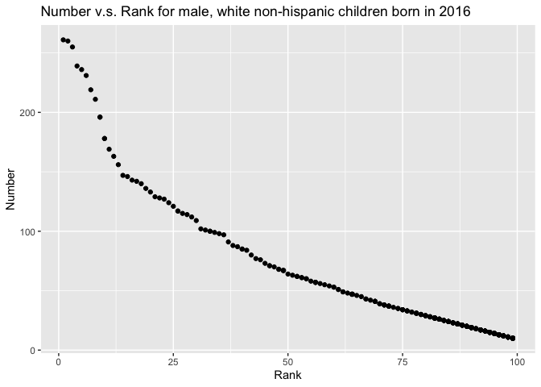

HW 2
================
Shihui Zhu sz3029

``` r
# This chunk loads all the packages used in this homework
library(readxl)
library(tidyverse)
```

# Problem 1

## Read in Mr. Trash Wheel dataset and clean the data

``` r
mr_trash_wheel_df <- 
  read_excel("data/p1/Trash-Wheel-Collection-Totals-8-6-19.xlsx",
  sheet = 1,
  range = "A2:N408") %>%
  janitor::clean_names() %>%
  drop_na() %>%
  mutate(sports_balls = round(sports_balls, digits = 0)) # Round the number of sports balls to nearest integer
```

## Read in precipitation data for 2018

``` r
preci_18_df <- 
  read_excel("data/p1/Trash-Wheel-Collection-Totals-8-6-19.xlsx",
  sheet = 5,
  range = "A2:B14") %>%
  janitor::clean_names() %>%
  mutate(year = "2018") # Add year variable
```

## Read in precipitation data for 2019

``` r
preci_19_df <- 
  read_excel("data/p1/Trash-Wheel-Collection-Totals-8-6-19.xlsx",
  sheet = 4,
  range = "A2:B14") %>%
  janitor::clean_names() %>%
  mutate(year = "2019") # Add year variable
```

## Combine precipitation data for 2018 and 2019, and convert month to character variable

``` r
preci_18_and_19_df <- 
  bind_rows(preci_18_df, preci_19_df) %>%
  mutate(month = month.name[month]) # convert month to character variable
```

## Description for Mr. Trash Wheel dataset

The Mr. Trash Wheel dataset contains 14 variables: dumpster, month,
year, date, weight\_tons, volume\_cubic\_yards, plastic\_bottles,
polystyrene, cigarette\_butts, glass\_bottles, grocery\_bags,
chip\_bags, sports\_balls, homes\_powered. Columns from
`plastic_bottles` to `homes_powered` indicate different kinds of trash
collected at Mr. Trash Wheel. The dataset contains 344 rows and 14
columns of observations. The data were collected from years 2014, 2015,
2016, 2017, 2018, 2019. The total weight of trash collected over the 6
years was 1122.45 tons, with a total volume of 5347 cubic yards. A table
displaying the values of the key variables for each year is shown below:

| Variable             | Year | Missing |      Mean |        SD |     Median | Histogram |
|:---------------------|-----:|--------:|----------:|----------:|-----------:|:----------|
| weight\_tons         | 2014 |       0 |     3.212 |     0.880 |      3.160 | ▂▇▇▇▁     |
| weight\_tons         | 2015 |       0 |     3.363 |     0.794 |      3.400 | ▃▅▇▃▁     |
| weight\_tons         | 2016 |       0 |     3.227 |     0.804 |      3.160 | ▅▆▇▃▂     |
| weight\_tons         | 2017 |       0 |     3.179 |     0.737 |      3.300 | ▂▇▅▇▃     |
| weight\_tons         | 2018 |       0 |     3.338 |     0.662 |      3.310 | ▁▁▅▇▃     |
| weight\_tons         | 2019 |       0 |     3.083 |     0.569 |      3.065 | ▅▇▂▁▁     |
| volume\_cubic\_yards | 2014 |       0 |    15.205 |     2.464 |     15.000 | ▁▁▇▂▃     |
| volume\_cubic\_yards | 2015 |       0 |    15.535 |     2.229 |     15.000 | ▁▁▁▇▅     |
| volume\_cubic\_yards | 2016 |       0 |    16.000 |     1.428 |     15.000 | ▇▁▁▁▃     |
| volume\_cubic\_yards | 2017 |       0 |    16.091 |     1.456 |     15.000 | ▇▁▁▁▅     |
| volume\_cubic\_yards | 2018 |       0 |    15.323 |     1.034 |     15.000 | ▁▁▇▁▁     |
| volume\_cubic\_yards | 2019 |       0 |    14.967 |     0.183 |     15.000 | ▁▁▁▁▇     |
| plastic\_bottles     | 2014 |       0 |  1877.045 |  1212.055 |   1540.000 | ▇▅▂▁▁     |
| plastic\_bottles     | 2015 |       0 |  1917.324 |   790.696 |   1960.000 | ▆▆▅▇▆     |
| plastic\_bottles     | 2016 |       0 |  2973.922 |   930.090 |   2980.000 | ▃▆▇▇▇     |
| plastic\_bottles     | 2017 |       0 |  1997.818 |  1029.120 |   2260.000 | ▆▂▅▇▃     |
| plastic\_bottles     | 2018 |       0 |  1331.183 |   651.968 |   1200.000 | ▇▇▅▅▁     |
| plastic\_bottles     | 2019 |       0 |  1343.167 |   789.442 |   1075.000 | ▇▇▅▂▂     |
| polystyrene          | 2014 |       0 |  2338.841 |  1259.887 |   2075.000 | ▇▇▃▂▁     |
| polystyrene          | 2015 |       0 |  2502.958 |  1076.671 |   2570.000 | ▆▅▇▂▁     |
| polystyrene          | 2016 |       0 |  3559.765 |   935.922 |   3720.000 | ▂▃▇▇▁     |
| polystyrene          | 2017 |       0 |  1989.273 |   958.133 |   2330.000 | ▆▂▂▇▇     |
| polystyrene          | 2018 |       0 |  1274.731 |   653.989 |   1020.000 | ▇▇▅▂▁     |
| polystyrene          | 2019 |       0 |  1519.333 |   783.317 |   1350.000 | ▇▇▅▅▂     |
| cigarette\_butts     | 2014 |       0 | 94590.909 | 47523.956 | 100000.000 | ▂▇▁▁▁     |
| cigarette\_butts     | 2015 |       0 | 40225.352 | 18598.923 |  34000.000 | ▁▇▅▁▃     |
| cigarette\_butts     | 2016 |       0 | 37639.216 | 13232.930 |  38000.000 | ▇▇▇▇▂     |
| cigarette\_butts     | 2017 |       0 | 12709.091 |  8361.448 |  13000.000 | ▇▇▇▂▃     |
| cigarette\_butts     | 2018 |       0 |  8637.634 |  4835.195 |   7000.000 | ▇▇▃▂▁     |
| cigarette\_butts     | 2019 |       0 |  4650.667 |  2133.735 |   4550.000 | ▆▅▅▇▃     |
| glass\_bottles       | 2014 |       0 |    46.750 |    22.276 |     46.500 | ▅▇▇▃▁     |
| glass\_bottles       | 2015 |       0 |    32.775 |    12.649 |     31.000 | ▇▇▆▃▂     |
| glass\_bottles       | 2016 |       0 |    40.353 |    11.976 |     41.000 | ▂▂▇▅▂     |
| glass\_bottles       | 2017 |       0 |    20.545 |     8.335 |     21.000 | ▇▇▅▃▁     |
| glass\_bottles       | 2018 |       0 |     9.634 |     8.342 |      6.000 | ▇▂▁▁▁     |
| glass\_bottles       | 2019 |       0 |     8.533 |     6.016 |      6.000 | ▇▃▃▃▃     |
| grocery\_bags        | 2014 |       0 |   880.227 |   470.917 |    796.000 | ▇▇▃▁▁     |
| grocery\_bags        | 2015 |       0 |  1392.113 |   852.913 |   1340.000 | ▇▆▅▅▂     |
| grocery\_bags        | 2016 |       0 |  2292.098 |   653.832 |   2210.000 | ▆▇▆▂▃     |
| grocery\_bags        | 2017 |       0 |  1938.909 |   882.301 |   1950.000 | ▇▂▆▅▅     |
| grocery\_bags        | 2018 |       0 |   752.151 |   457.692 |    710.000 | ▇▇▅▂▁     |
| grocery\_bags        | 2019 |       0 |   666.833 |   305.491 |    650.000 | ▅▇▆▅▁     |
| chip\_bags           | 2014 |       0 |  1610.205 |   818.357 |   1495.000 | ▆▇▂▁▁     |
| chip\_bags           | 2015 |       0 |  1849.155 |   964.679 |   1760.000 | ▇▆▅▆▁     |
| chip\_bags           | 2016 |       0 |  2752.353 |   716.884 |   2640.000 | ▆▇▆▃▂     |
| chip\_bags           | 2017 |       0 |  2237.091 |   952.796 |   2230.000 | ▇▃▆▇▃     |
| chip\_bags           | 2018 |       0 |  1279.355 |   598.881 |   1200.000 | ▇▇▇▃▂     |
| chip\_bags           | 2019 |       0 |   929.500 |   449.023 |    790.000 | ▅▇▅▃▂     |
| sports\_balls        | 2014 |       0 |     6.045 |     1.011 |      6.000 | ▁▁▇▃▁     |
| sports\_balls        | 2015 |       0 |    17.437 |     9.370 |     16.000 | ▆▇▂▁▁     |
| sports\_balls        | 2016 |       0 |    25.667 |     9.919 |     26.000 | ▂▃▇▅▃     |
| sports\_balls        | 2017 |       0 |     9.636 |     4.836 |      8.000 | ▇▇▇▁▂     |
| sports\_balls        | 2018 |       0 |     4.817 |     3.742 |      4.000 | ▇▅▂▁▁     |
| sports\_balls        | 2019 |       0 |     9.067 |     5.356 |      8.500 | ▇▇▇▇▁     |
| homes\_powered       | 2014 |       0 |     0.000 |     0.000 |      0.000 | ▁▁▇▁▁     |
| homes\_powered       | 2015 |       0 |    38.087 |    28.076 |     48.333 | ▇▂▆▇▁     |
| homes\_powered       | 2016 |       0 |    53.788 |    13.400 |     52.667 | ▅▆▇▃▂     |
| homes\_powered       | 2017 |       0 |    52.982 |    12.280 |     55.000 | ▂▇▅▇▃     |
| homes\_powered       | 2018 |       0 |    55.625 |    11.026 |     55.167 | ▁▁▅▇▃     |
| homes\_powered       | 2019 |       0 |    51.378 |     9.477 |     51.083 | ▅▇▂▁▁     |

The dataset includes information about different kinds of trash
collected. For example, the total number of sports balls collected in
2019 was 272, and the median number is 8.5.

## Description for precipitation data for 2018 and 2019

The precipitation dataset contains data of total precipitation per month
from 2018 to 2019. It has 3 variables: month, total, year, with a
dimension of 24 rows and 3 columns. The total precipitation in year 2018
was 70.33.

# Problem 2

## Clean data in pols-month.csv

-   break up the variable `mon` into integer variables `year`, `month`,
    and `day`
-   replace month number with month name
-   create a `president` variable taking values `gop` and `dem`, and
    remove `prez_dem` and `prez_gop`
-   remove the `day` variable

``` r
pols <- read_csv("data/p2/pols-month.csv") %>%
  janitor::clean_names() %>%
  separate(mon, into = c("year", "month", "day"), convert = TRUE) %>% # convert the format of date
  mutate(month = month.name[month], # convert month name to string
         president = recode(prez_dem, `1` = "dem", `0` = "gop")) %>% # create president variable and assign value
  select(-day, -prez_dem, -prez_gop) # remove unnecessary columns
```

## Clean data in snp.csv

Use similar process as above:

-   break up the variable `date` into integer variables `year`, `month`,
    and `day`
-   replace month number with month name
-   remove `day` variable

``` r
snp <- read_csv("data/p2/snp.csv") %>%
  janitor::clean_names() %>%
  mutate(date = as.Date(as.character(date),"%m/%d/%y"),
         date = as.Date(ifelse(date > Sys.Date(),
                        format(date, "19%y-%m-%d"),
                        format(date)))) %>% 
  separate(date, into = c("year", "month", "day"), convert = TRUE) %>% # reformat the date
  select(year, month, everything()) %>% # make year and month as the leading columns
  mutate(month = month.name[month]) %>% # convert month name to string
  select(-day) # remove day column
```

## Tidy unemployment data

-   switching from “wide” to “long” format
-   match the variable names

``` r
unemployment <- read_csv("data/p2/unemployment.csv") %>%
  pivot_longer(
    Jan:Dec,
    names_to = "month",
    values_to = "unemployment_percent"
  ) %>%
  mutate(month = match(month, month.abb),
         month = month.name[month]) %>% # reformat the date
  janitor::clean_names()
```

## Merge the datasets

-   merge `snp` into `pols` via `left_join()`
-   merge with `unemployment` data

``` r
pols_snp <-
  left_join(pols, snp, by = c("year", "month"))
pols_snp_unemployment <-
  left_join(pols_snp, unemployment, by = c("year", "month"))
```

## Descriptions for datasets: `pols`, `snp`, `unemployment`, and `pols_snp_unemployment` merged from those

1.  The `pols` dataset contains 822 observations from 9 variables. The
    variables are year, month, gov\_gop, sen\_gop, rep\_gop, gov\_dem,
    sen\_dem, rep\_dem, president. This dataset contains information
    related to the number of national politicians who are democratic or
    republican at any given time, ranging from 1947 to 2015 i.e. range
    of 68 years.

2.  The `snp` dataset contains 787 observations from 3 variables. The
    variables are year, month, close. This dataset contains information
    related to Standard & Poor’s stock market index (S&P), often used as
    a representative measure of stock market as a whole, ranging from
    1950 to 2015 i.e.  range of 65 years.

3.  The `unemployment` dataset contains 816 observations from 3
    variables. The variables are year, month, unemployment\_percent.
    This dataset contains information about percentage of unemployment
    at any given time, ranging from 1948 to 2015 i.e. range of 67 years.

4.  The merged dataset from the above three, `pols_snp_unemployment`,
    contains 822 observations from 9 variables. The variables are year,
    month, gov\_gop, sen\_gop, rep\_gop, gov\_dem, sen\_dem, rep\_dem,
    president. This dataset contains information related to the number
    of national politicians who are democratic or republican, the
    Standard & Poor’s stock market index (S&P), and the percentage of
    unemployment at any given time, ranging from 1947 to 2015 i.e. range
    of 68 years.

# Problem 3

## Load and tidy the dataset for `Popular_Baby_Names.csv`

-   convert all characters to lower cases
-   remove duplicated rows

``` r
baby_name <- read_csv("data/p3/Popular_Baby_Names.csv") %>%
  janitor::clean_names() %>%
  mutate(gender = str_to_upper(gender),
         ethnicity = str_to_upper(ethnicity),
         childs_first_name = str_to_upper(childs_first_name)
         ) %>%
  distinct() # remove duplicated rows
```

## Create a table of rank in popularity of the name “Olivia” as a female baby name over time

``` r
olivia <-
  baby_name %>%
  dplyr::filter(childs_first_name == "OLIVIA") %>%
  select(-childs_first_name, -gender) %>%
  arrange(year_of_birth) %>%
  knitr::kable(
    col.names = c("Year of Birth", "Ethnicity", "Count", "Rank"),
    caption = "The Table of Rank in Popularity of the Name “Olivia” As a Female Baby Name Over Time"
  )
olivia
```

| Year of Birth | Ethnicity                  | Count | Rank |
|--------------:|:---------------------------|------:|-----:|
|          2011 | ASIAN AND PACIFIC ISLANDER |    89 |    4 |
|          2011 | BLACK NON HISPANIC         |    52 |   10 |
|          2011 | HISPANIC                   |    86 |   18 |
|          2011 | WHITE NON HISPANIC         |   213 |    2 |
|          2012 | ASIAN AND PACI             |   132 |    3 |
|          2012 | BLACK NON HISP             |    58 |    8 |
|          2012 | HISPANIC                   |    77 |   22 |
|          2012 | WHITE NON HISP             |   198 |    4 |
|          2013 | ASIAN AND PACIFIC ISLANDER |   109 |    3 |
|          2013 | BLACK NON HISPANIC         |    64 |    6 |
|          2013 | HISPANIC                   |    87 |   22 |
|          2013 | WHITE NON HISPANIC         |   233 |    1 |
|          2014 | ASIAN AND PACIFIC ISLANDER |   141 |    1 |
|          2014 | BLACK NON HISPANIC         |    52 |    8 |
|          2014 | HISPANIC                   |    96 |   16 |
|          2014 | WHITE NON HISPANIC         |   248 |    1 |
|          2015 | ASIAN AND PACIFIC ISLANDER |   188 |    1 |
|          2015 | BLACK NON HISPANIC         |    82 |    4 |
|          2015 | HISPANIC                   |    94 |   16 |
|          2015 | WHITE NON HISPANIC         |   225 |    1 |
|          2016 | ASIAN AND PACIFIC ISLANDER |   172 |    1 |
|          2016 | BLACK NON HISPANIC         |    49 |    8 |
|          2016 | HISPANIC                   |   108 |   13 |
|          2016 | WHITE NON HISPANIC         |   230 |    1 |

The Table of Rank in Popularity of the Name “Olivia” As a Female Baby
Name Over Time

## Create a table of the most popular name among male children over time

``` r
male <-
  baby_name %>%
  dplyr::filter(gender == "MALE",
                rank == '1') %>%
  select(-gender, -rank) %>%
  arrange(year_of_birth) %>%
  knitr::kable(
    col.names = c("Year of Birth", "Ethnicity", "Children's Names", "Count"),
    caption = "The Table of the Most Popular Name Among Male Children Over Time"
  )
male
```

| Year of Birth | Ethnicity                  | Children’s Names | Count |
|--------------:|:---------------------------|:-----------------|------:|
|          2011 | ASIAN AND PACIFIC ISLANDER | ETHAN            |   177 |
|          2011 | BLACK NON HISPANIC         | JAYDEN           |   184 |
|          2011 | HISPANIC                   | JAYDEN           |   426 |
|          2011 | WHITE NON HISPANIC         | MICHAEL          |   292 |
|          2012 | ASIAN AND PACI             | RYAN             |   197 |
|          2012 | BLACK NON HISP             | JAYDEN           |   171 |
|          2012 | HISPANIC                   | JAYDEN           |   364 |
|          2012 | WHITE NON HISP             | JOSEPH           |   300 |
|          2013 | ASIAN AND PACIFIC ISLANDER | JAYDEN           |   220 |
|          2013 | BLACK NON HISPANIC         | ETHAN            |   146 |
|          2013 | HISPANIC                   | JAYDEN           |   352 |
|          2013 | WHITE NON HISPANIC         | DAVID            |   304 |
|          2014 | ASIAN AND PACIFIC ISLANDER | JAYDEN           |   187 |
|          2014 | BLACK NON HISPANIC         | ETHAN            |   138 |
|          2014 | HISPANIC                   | LIAM             |   312 |
|          2014 | WHITE NON HISPANIC         | JOSEPH           |   300 |
|          2015 | ASIAN AND PACIFIC ISLANDER | JAYDEN           |   190 |
|          2015 | BLACK NON HISPANIC         | NOAH             |   163 |
|          2015 | HISPANIC                   | LIAM             |   356 |
|          2015 | WHITE NON HISPANIC         | DAVID            |   299 |
|          2016 | ASIAN AND PACIFIC ISLANDER | ETHAN            |   193 |
|          2016 | BLACK NON HISPANIC         | NOAH             |   148 |
|          2016 | HISPANIC                   | LIAM             |   387 |
|          2016 | WHITE NON HISPANIC         | JOSEPH           |   261 |

The Table of the Most Popular Name Among Male Children Over Time

## Scatter Plot

-   For male, white non-hispanic children born in 2016, produce a
    scatter plot showing the number of children with a name (y axis)
    against the rank in popularity of that name (x axis)

``` r
# Select the names
male_nh <-
  baby_name %>%
  dplyr::filter(gender == "MALE",
                year_of_birth == '2016',
                ethnicity == "WHITE NON HISPANIC") %>%
  select(rank, childs_first_name, count)

# Create the plot
ggplot(male_nh, aes(x = rank, y = count)) +
  geom_point() +
  xlab("Rank") +
  ylab("Number") +
  ggtitle("Number v.s. Rank for male, white non-hispanic children born in 2016")
```

<!-- -->

``` r
## Save the plot
ggsave("hw2_p2_scatter_plot.jpg")
```

    ## Saving 7 x 5 in image
